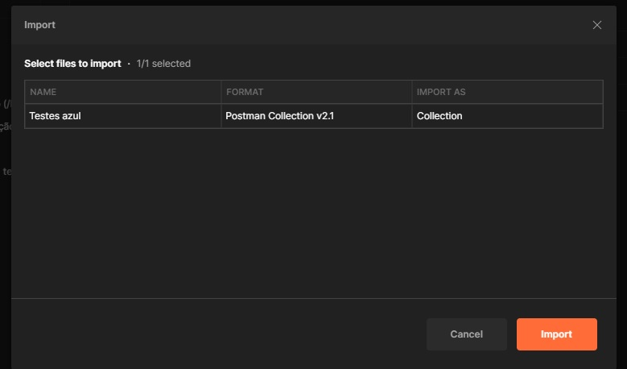
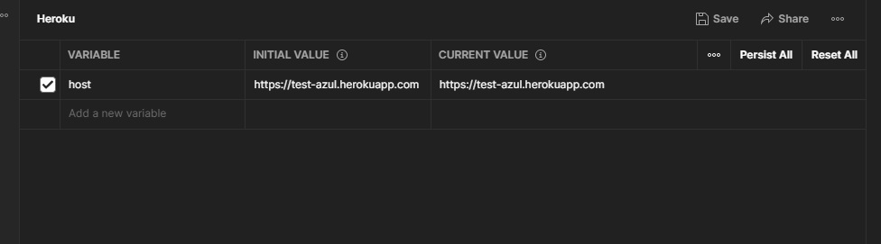
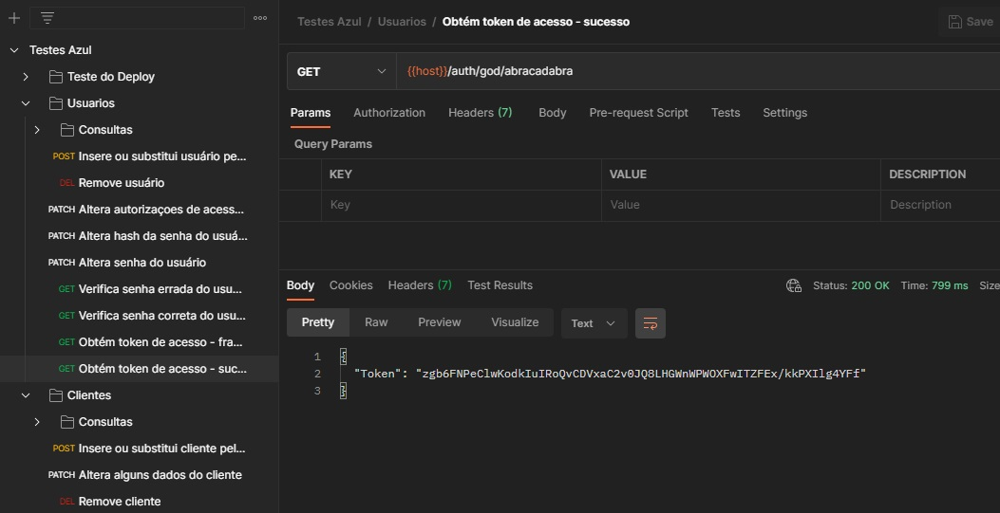
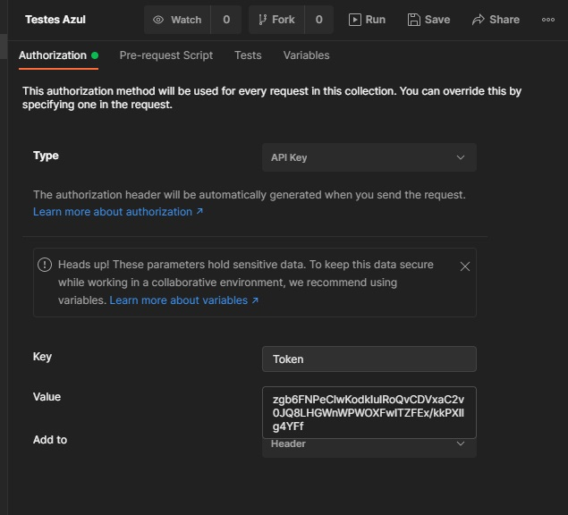
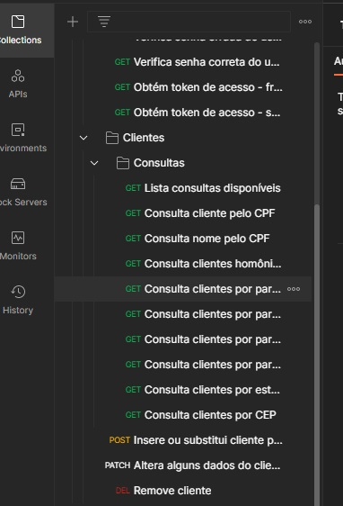

# Teste azul (v2.0.0)

## Curriculum Online

Foi criado um recurso para visualização do currículo do autor, David Machado Santos Filho. Todos os dados do currículo são gerados programaticamente, e exibidos ou baixados nos visualizadores apropriados.

Atualmente existem duas visões distintas implementadas:

* Visão REST: o autor usa para depuração, e simplesmente apresenta um retorno JSON sobre o model dos dados preenchidos. Óbviamente não é uma versão para apresentação formal, mas apenas um auxílio para desenvolvimento. 
O endpoint desta visão é: https://test-azul.herokuapp.com/cv


* Visão HTML: aqui é gerada uma página HTML com as informações do currículo do autor, mais adequada para ser apresentada. Isto permite criar uma separação entre a apresentação dos dados e os dados em si, possibilitando dividir o foco em cada um dos aspectos de cada vez. 
Esta visão HTML é acessada na seguinte URL: https://test-azul.herokuapp.com/curriculum


Outros formatos estão previstos, este eles arquivos WORD (doc), PDFs e mesmo saidas em LateX, formato bastante apreciado pelo autor. Aparecerão em versões posteriores desta aplicação.


## Código Fonte (GitHub)

O código fonte da aplicação foi disponibilizado no GitHub pelo link: 

https://github.com/davidmachadosf/teste_azul.git

## Deploy (Heroku)

Configurou-se o github para que todo novo commit na branch master automaticamente publicasse a versão recente da aplicação na plataforma Heroku. A homepage web da aplicação pode ser acessada pela url:

https://test-azul.herokuapp.com


## Checagem de status (Actuator)

Pode ser feita uma checagem básica do status da aplicação pelos seguintes endpoints gerados pela ferramenta *Actuator*:

https://test-azul.herokuapp.com/actuator/health - verifica se a aplicação iniciou sem problemas

https://test-azul.herokuapp.com/actuator/env - exibe todas as variáveis do ambiente onde se encontra a aplicação


## Documentação da API-Rest no Swagger

Os endpoints expostos da API Rest, criado automaticamente pelo **Spring Data REST**, podem ser consultados nesta URL:

https://test-azul.herokuapp.com/swagger-ui/


## Base de Dados

Utilizou-se uma base de dados PostGres também hospedada na plataforma Heroku, como a aplicação. Decidiu-se por criar uma base de dados volátil, ou seja, ela é apagada e recriada após cada restart da aplicação, comportamento que pode ser facilmente alterado se necessário.

Neste exemplo simples a base de dados é composta de apenas duas tabelas: 

`tb01_usuarios` 

Login (chave primária) dos usuários cadastrados no sistema, bem como o hash de suas senhas (as senhas não são armazenada como texto legível na base) e uma lista de Autorizações (Roles) de cada usuário, que controla quais os serviços ele pode acessar. A estrutura desta tabela é a seguinte:

campo | tipo | chave 
----- | ---- | ------
login | VARCHAR( 10) | PRIMARY KEY
roles | VARCHAR( 50) |
hash  | VARCHAR(255) |

`tb02_clientes`

Clientes cadastrados no sistema pelos usuários habilitados para isto (com Role=EDIT, vide item seguinte), com número de CPF (chave primária), nome e dados de endereço composto de logradouro, bairro, cidade, estado (sigla) e CEP. A estrutura desta tabela na base é a seguinte:

campo | tipo | chave 
----- | ---- | ------
cpf         | VARCHAR(11) | PRIMARY KEY
nome        | VARCHAR(60) |
nome        | VARCHAR(60) |
endereco_id | INT         |


`tb03_enderecos`

Embora tenha uma relação simples de um-para-um com a tabela de clientes, sendo ambas ligadas pera chave endereco_id<->id, as informações de endereço foram mantidas separadas por organização e clareza. O único dado essencial é o cep. As demais informações são preenchidas por consulta ao sistema externo **ViaCEP**, embora possam ser alteradas em seguida com a desvantagem de se estar correndo o risco de comprometer a integridade destas informações. Naturalmente a informação de logradouro precisa ser complementada depois da consulta, copm informação d número da residência por exemplo. A chave desta tabela é obtida de uma sewquence do banco de dados criada para esta finalidade.

campo | tipo | chave 
----- | ---- | ------
id         | INT         |
cep        | VARCHAR( 9) |
logradouro | VARCHAR(60) |
bairro     | VARCHAR(40) |
localidade | VARCHAR(40) |
uf         | VARCHAR( 2) |


`seq01_enderecos`

A sequence usada para criar as chaves inteiras da tabela de endereços, definida como:


. | . 
----- | ---- 
NOME | seq01_enderecos
MINVALUE | 1
MAXVALUE 9999999999999999
START | 1
INCREMENT | 1


## Autorizações de acesso aos serviços

As autorizações de acesso que podem ser atribuidas aos usuários são os seguintes:

`ADMIN` tem permissão para:
>* cadastrar usuários novos
>* alterar a senha de qualquer usuário (incluindo sua própria)
>* alterar nome e autorizações de acess de acesso de usuários
>* deletar usuários
>* procurar e visualizar usuarios

`EDIT` tem permissão para:
>* alterar a própria senha 
>* cadastrar clientes novos
>* alterar dados clientes
>* deletar clientes 

`VIEW` tem permissão para:
>* alterar a própria senha 
>* procurar e visualizar  clientes 

`OWNER` tem permissão para:
>* indica que usuário só pode acessar o serviço se estiver alterando seus próprios dados


Porém tais autorizações só foram reaproveitadas de projeto anterior que as exigia. Para este projeto mais simples o usuário tem permissão total de acesso e modificação a tudo, mas as autorizações por endpoint e métodos de acesso podem ser reconfiguradas se isto for desejado.


## Serviço de obtenção de token

Para acessar os serviços que requerem autorizações de acesso é necessário, inicialmente, adquirir um token fornecendo login e senha para o serviço (trocando *login* e *senha* na URI abaixo pelo login e senha do usuário):

>* `GET` https://test-azul.herokuapp.com/auth/LOGIN_DO_USUARIO/SENHA

Será devolvido um token, que deve ser incluido no Header das requisições. Isto será explicado posteriormente, nas instruções de como testar a API Rest da aplicação:
```
{
  "Token": "zgb6FNPeClwKodkIuIRoQvCDVxaC2v0JCysTC6fIlk9/FCvrh7Z8pkkPXIlg4YFf"
}
```

Estão cadastrados inicialmente os seguintes usuários com as seguintes autorizações de acesso:

Login  | Roles	
------ | ------
god    | ADMIN,EDIT,VIEW
admin  | ADMIN
edit01 | EDIT
user01 | VIEW
user02 | VIEW


O hash inicialmente cadastrados para todos estes usuários corresponde à senha **abracadabra**.

Foi criado um usuário de login **god** para testes de desenvolvimento, com permissão cadastrada para todas as Roles possíveis. Na prática, ele está autorizado a chamar tdos os serviços REST do sistema, se gerar um token de autenticação com seu login e senha. 

Os tokens gerados expiram depois de 2 horas e 30 minutos, e depois deste período será necessário solicitar um novo token para continuar usando os serviços.


## Serviços de alteração e verificação de senhas

Deve ser feita uma requisição com o método **PATCH** para anteração de senha. Usuários com autorização de ``ADMIN`` podem alterar a senha de qualquer usuário. Usuários sem o perfil de ``ADMIN`` só podem alterar suas próprias senhas. Dada a natureza do armazenamento das senhas como um *hash* adicionado a um *salt* randômico, a única maneira de se recuperar uma senha esquecida é um usuário com perfil ``ADMIN`` inicialmente redefinindo a senha do usuário com alguma conhecida e este, posteriormente, obter um token com esta senha e alterá-la como desejar. A seguinte chamada é um exemplo de redifição de senha do usuário *edit01*:

>* `POST` https://test-azul.herokuapp.com/alterasenha/edit01/abretesézamo

Também existe um serviço para checar a senha de um usuário, util na fase de desenvolvimento. Este é um exemplo de senha validada corretamente:

>* `GET` https://test-azul.herokuapp.com/verificasenha/edit01/abretesézamo
```
true
```

Exemplo de senha incorreta:

>* `GET` https://test-azul.herokuapp.com/verificasenha/edit01/abracadabra
```
false
```


Exemplo de validação de senha de um usuário inexistente no sistema:

>* `GET` https://test-azul.herokuapp.com/verificasenha/ninguem/xxxxxxx
```
Usuário Inexistente!
```


## Instruções para teste no Postman

* Baixar o arquivo [Testes Azul.postman_collection.json](https://github.com/davidmachadosf/test_azul/blob/master/src/test/postman/Testes%20Azul.postman_collection.json) e importar como uma colection do Postman:



* Criar um ambiente "Heroku" e setar nele a variável **host** com o valor *https://test-azul.herokuapp.com*:



* Obter um token para conseguir utilizar os serviços. Para testes foi criado o usuário *god* de senha *abracadabra* com acesso irrestrito a todos os serviços da aplicação:



* Abrir a aba da colection *Testes azul*. Na área de *Authorization*, escolher o type **API Key** e inserir o token recebido no passo anterior. Este token será enviado em todas as requisições da collection, e expira em 2h30.



* As principais consultas, updates e remoções estão pré-configuradas na collection, separadas por pastas. Escolha o request alterando os parâmetros conforme o teste que se deseja efetuar:


 
 
